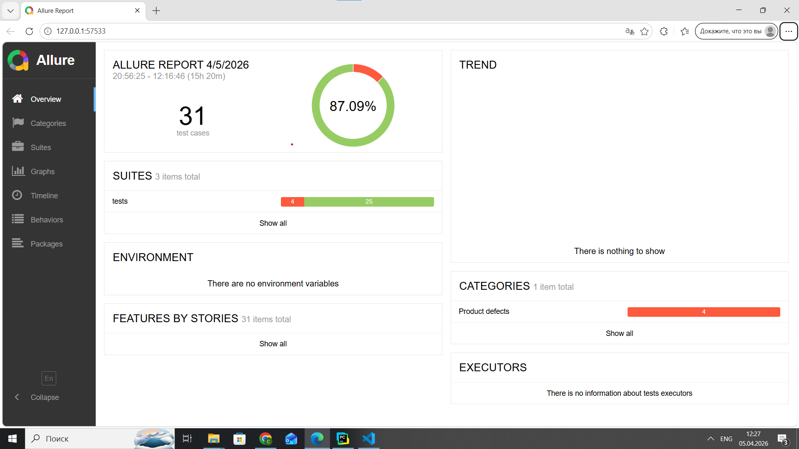
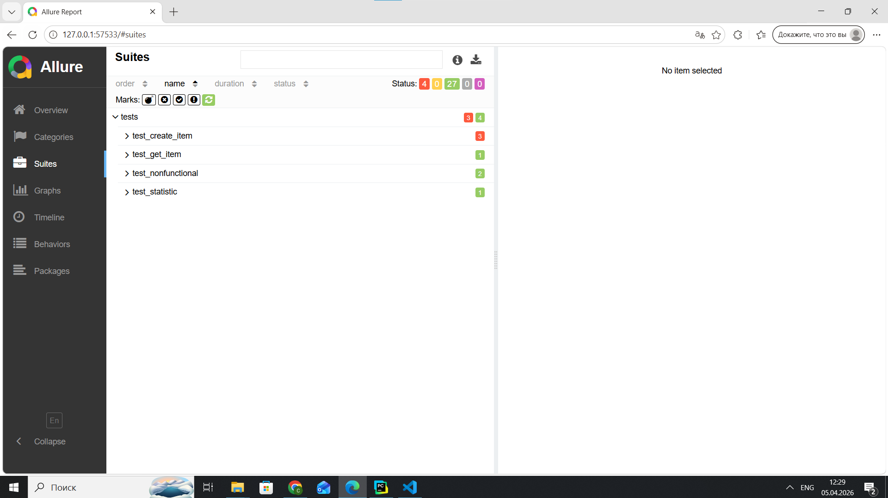
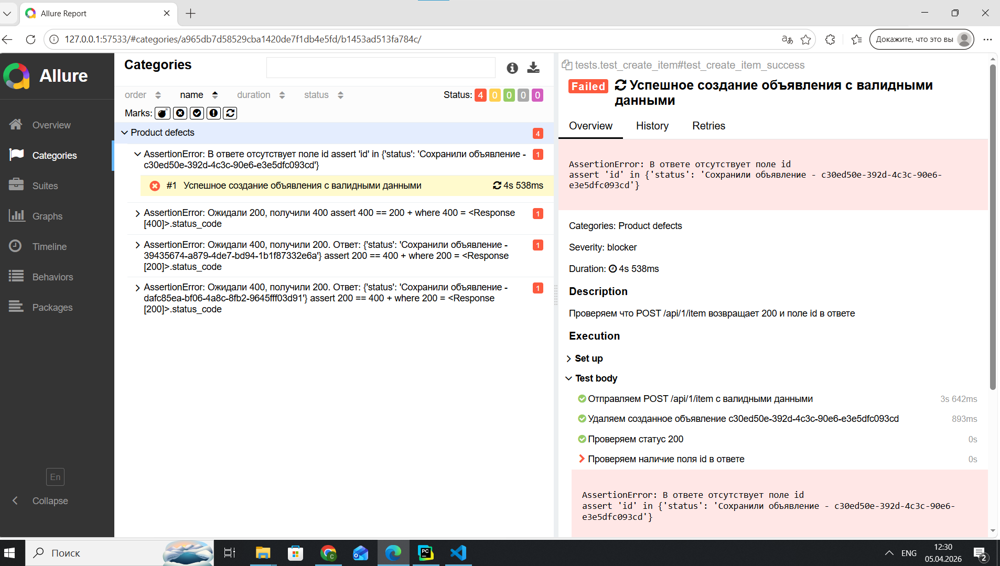

# Тесты API — Avito QA Internship

Автоматизированные тесты для микросервиса `https://qa-internship.avito.com`.

---

## Структура проекта

```
TestAvito/
├── utils/
│   ├── api_client.py         # клиент для работы с API
│   ├── helpers.py            # вспомогательные функции
├── tests/
│   ├── __init__.py
│   ├── conftest.py           # фикстуры
│   ├── test_create_item.py   # тесты POST /api/1/item
│   ├── test_get_item.py      # тесты GET /api/1/item и GET /api/1/{sellerId}/item
│   ├── test_statistic.py     # тесты GET /api/1/statistic и GET /api/2/statistic
│   ├── test_nonfunctional.py # нефункциональные проверки
│   └── test_e2e.py           # E2E сценарии
├── allure-example.html       # Пример отчета allure
├── setup.cfg                 # конфигурация flake8
├── pyproject.toml            # конфигурация black
├── requirements.txt
├── TESTCASES.md              # Тест-кейсы
├── BUGS.md                   # Баг-репорты
└── task_1.md                 # 1 задание

```

---

## Установка зависимостей

Убедитесь, что на вашем компьютере установлен Python 3.9+. Проверить можно командой:

```bash
python --version
```

```bash
pip install -r requirements.txt
```

---

### Запуск всех тестов

```bash
pytest tests/
```

### Запуск конкретного файла

```bash
pytest tests/test_create_item.py
```

### Запуск конкретного теста

```bash
pytest tests/test_create_item.py::test_create_item_success
```

---

## Allure отчёт

### Установка Allure CLI

**macOS / Linux (через Homebrew):**
```bash
brew install allure
```

**Windows (через Scoop):**
```powershell
Set-ExecutionPolicy -ExecutionPolicy RemoteSigned -Scope CurrentUser
Invoke-RestMethod -Uri https://get.scoop.sh | Invoke-Expression
scoop install allure
```

### Запуск тестов с сохранением результатов

```bash
pytest tests/ --alluredir=allure-results
```

### Генерация HTML отчёта

```bash
allure generate allure-results --clean -o allure-report
```

### Открыть отчёт в браузере

```bash
allure serve allure-results
```

---
## Пример Allure отчёта

**Overview — общая сводка:**


**Suites — список тестов с шагами:**


**Пример упавшего теста:**

---

## Линтер и форматтер

Конфигурация описана в `setup.cfg` (flake8) и `pyproject.toml` (black).

### Форматирование кода

```bash
black tests/
```

### Проверка кода линтером

```bash
flake8 tests/
```

---

## Известные баги

Обнаруженные дефекты описаны в файле [BUGS.md](BUGS.md).

Тесты, связанные с багами, **ожидаемо падают** — это задокументированное поведение сервиса, а не ошибки в коде тестов.
